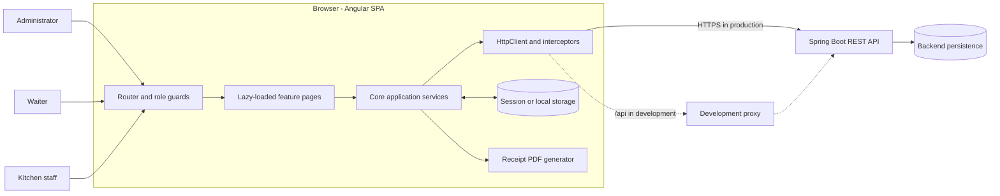
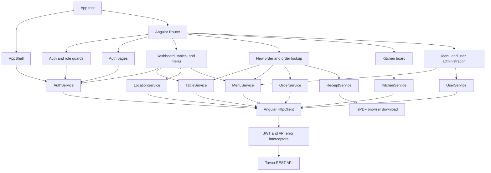
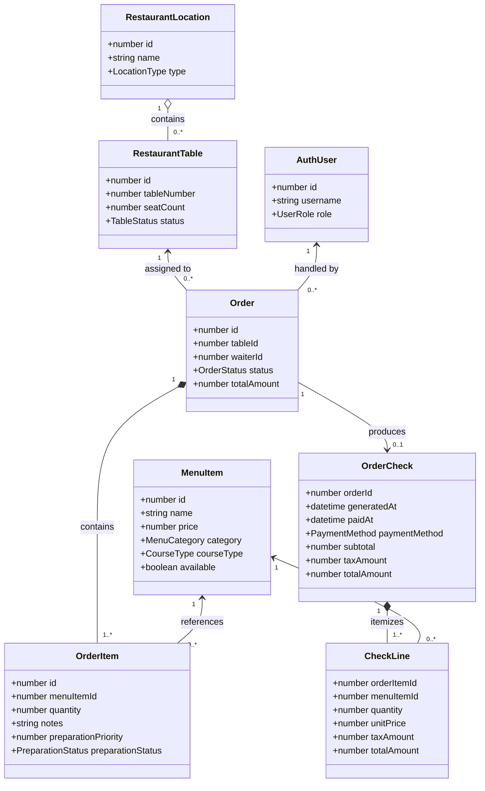
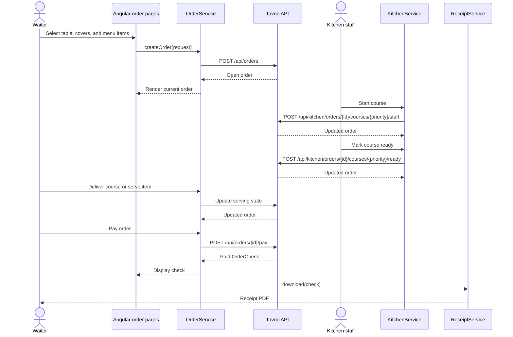

# Tavoo frontend

Tavoo is an Angular 21 single-page application for restaurant point-of-sale operations. It is the browser client for the Tavoo Spring Boot order and billing API and provides role-specific workspaces for administrators, waiters, and kitchen staff.

## Technology stack

- Angular 21 standalone components and signals
- Angular Router with lazy-loaded feature pages
- Angular `HttpClient` and RxJS for API communication
- Reactive Forms for user input
- Tailwind CSS 4 and Spartan UI components
- jsPDF for client-side receipt generation
- Vitest and jsdom for unit tests

## Run locally

Start the backend on `http://localhost:8080`, then run:

```bash
npm install
npm start
```

Open `http://localhost:4200`. During development, `proxy.conf.json` forwards `/api` requests to the backend on port 8080.

## Quality checks

```bash
npm run build
npm run test -- --watch=false
```

## System architecture

Tavoo uses a client-server architecture. The Angular frontend owns presentation, navigation, session state, and receipt rendering. Business rules and persistent data are owned by the Spring Boot REST API.



### Frontend layers

| Layer                 | Location                                                        | Responsibility                                                                                                        |
| --------------------- | --------------------------------------------------------------- | --------------------------------------------------------------------------------------------------------------------- |
| Bootstrap and routing | `src/main.ts`, `src/app/app.config.ts`, `src/app/app.routes.ts` | Starts the standalone application, registers providers, and lazy-loads protected routes.                              |
| Features              | `src/app/features`                                              | Implements pages and user workflows for authentication, tables, orders, menu, kitchen, dashboard, and administration. |
| Core                  | `src/app/core`                                                  | Contains API services, route guards, HTTP interceptors, configuration, and API contracts.                             |
| Shared                | `src/app/shared`                                                | Provides the authenticated application shell and reusable presentation components.                                    |
| Environment           | `src/environments`                                              | Selects the API base URL for development and production builds.                                                       |

Dependencies point inward toward `core` contracts and services: feature pages may use `core` and `shared`, while `core` does not depend on a feature. HTTP access is kept in root-provided services rather than page components.

### Request and security flow

1. Route guards restore the current session through `AuthService` before activating a page.
2. `roleGuard` checks the route's allowed roles and redirects unauthorized users to `/forbidden`.
3. Feature components call a domain-focused service such as `OrderService` or `KitchenService`.
4. `jwtAuthInterceptor` adds the Bearer token to API calls and clears the session after an authenticated `401` response.
5. `apiErrorInterceptor` converts backend and network failures into the application's `ApiError` model.
6. The service exposes the result as an RxJS `Observable`; the component updates its local signal-based UI state.

JWT metadata is stored in `sessionStorage` by default or `localStorage` when **Remember me** is selected. The authenticated user is kept in memory and restored from `/api/auth/me`. Authorization remains enforced by the backend; frontend guards only control navigation and presentation.

## UML design

### Component diagram

The following diagram shows the main frontend components and their runtime dependencies.



### Domain class diagram

These TypeScript interfaces mirror the API resources used by the frontend.



### Order lifecycle sequence



## Routes and access control

| Route          | Purpose                                          | Roles              |
| -------------- | ------------------------------------------------ | ------------------ |
| `/login`       | Sign in                                          | Guest              |
| `/dashboard`   | Operational statistics                           | Admin, Waiter      |
| `/tables`      | Tables and locations                             | Admin, Waiter      |
| `/new-order`   | Create an order and assign a table               | Waiter             |
| `/menu`        | Browse available menu items                      | Admin, Waiter      |
| `/orders`      | Serve courses, generate checks, and take payment | Waiter             |
| `/kitchen`     | Start preparation and mark courses ready         | Admin, Kitchen     |
| `/admin/menu`  | Create menu items                                | Admin              |
| `/admin/users` | List and create staff accounts                   | Admin              |
| `/forbidden`   | Access-denied page                               | Authenticated user |

The empty route redirects authenticated kitchen users to `/kitchen` and other authenticated users to `/dashboard`. Unknown routes return to this role-aware entry point.

## Project structure

```text
src/
|-- app/
|   |-- core/
|   |   |-- config/          # API URL configuration
|   |   |-- guards/          # Authentication and role checks
|   |   |-- interceptors/    # JWT attachment and error normalization
|   |   |-- models/          # API request and response contracts
|   |   `-- services/        # Domain-focused API and receipt services
|   |-- features/            # Lazy-loaded workflow pages
|   |-- shared/
|   |   |-- components/      # Application shell
|   |   `-- ui/              # Reusable Spartan/Tailwind UI primitives
|   |-- app.config.ts
|   |-- app.routes.ts
|   `-- app.ts
|-- environments/            # Build-specific API configuration
`-- main.ts                  # Browser bootstrap
```

## Deployment notes and current API constraints

- Development uses the Angular proxy so browser requests can use the relative `/api` path.
- The production environment currently targets `http://localhost:8080`; a deployed system should configure the real API origin and HTTPS, or serve both applications behind a same-origin reverse proxy.
- `GET /api/menu` supplies the available menu used by the client; the current frontend does not expose update, delete, or availability-toggle operations.
- Receipts are generated entirely in the browser from the `OrderCheck` returned by the API and are not uploaded by this application.
